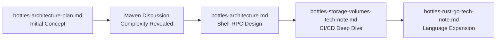

# Bottles Documentation Index

**Purpose**: Central navigation and reading guide for the bottles architecture documentation  
**Status**: 📚 DOCUMENTATION INDEX  
**Last Updated**: 2025-01-22 (Reorganized)  

## Overview

The "bottles" architecture provides self-contained testing environments for validating mcp-pkg-local across diverse package management ecosystems. This index guides readers through the documentation in logical order.

## Document Structure

### 📋 Core Documents (Read in Order)

#### 1. bottles-architecture-plan.md
**Location**: `../outdated/bottles-architecture-plan.md`  
**Status**: 📝 SUPERSEDED  
**Purpose**: Original planning document for replacing authly test dependency  
**Key Content**:
- Problem statement: Authly external dependency
- Initial bottle concept design
- Python, Node.js bottle specifications
- Migration strategy from authly

**⚠️ Note**: This document represents initial thinking and has been superseded by the revised architecture.

---

#### 2. [bottles-architecture.md](./bottles-architecture.md)
**Status**: 📐 ARCHITECTURE SPECIFICATION - REVISED  
**Purpose**: Complete architectural specification with shell-RPC design  
**Key Content**:
- Shell-based RPC architecture (major revision from initial plan)
- Native tool delegation principle
- Language-agnostic bottle pattern
- Volume management for CI/CD
- Implementation phases and testing strategy

**✅ Current**: This is the authoritative architecture document.

---

### 🔬 Technical Deep-Dives

#### 3. bottles-storage-volumes-tech-note.md
**Location**: `../unclear/bottles-storage-volumes-tech-note.md`  
**Status**: 🔬 UNCLEAR - Partial implementation?  
**Purpose**: Deep dive into storage, caching, and CI/CD integration  
**Key Content**:
- Cache persistence strategies across CI platforms
- Volume mount configurations
- Performance benchmarks and optimization
- Security considerations for cache management
- GitHub Actions, GitLab CI, Jenkins examples

---

#### 4. [bottles-rust-go-tech-note.md](./bottles-rust-go-tech-note.md)
**Status**: 🔬 TECHNICAL ANALYSIS  
**Purpose**: Analysis of Rust/Cargo and Go/modules integration  
**Key Content**:
- Rust's source-based distribution model
- Go's module proxy architecture
- Scanner integration patterns
- Comparison matrix of all package managers
- Implementation roadmap for new languages

---

## Reading Guide for Claude

### For Understanding the Architecture

**Quick Overview** (5 min):
1. Read this index file first
2. Skip to [bottles-architecture.md](./bottles-architecture.md) sections:
   - Executive Summary
   - Core Principles
   - Key Architectural Changes from Original

**Complete Understanding** (15 min):
1. Start with [bottles-architecture.md](./bottles-architecture.md) - the current design
2. Review [bottles-storage-volumes-tech-note.md](./bottles-storage-volumes-tech-note.md) for implementation details
3. Skim [bottles-architecture-plan.md](./bottles-architecture-plan.md) for historical context

**Language-Specific Implementation** (10 min):
- For Python/Node.js: [bottles-architecture.md](./bottles-architecture.md) Phase 2-4
- For Rust/Go: [bottles-rust-go-tech-note.md](./bottles-rust-go-tech-note.md)
- For Java/Maven: [bottles-architecture.md](./bottles-architecture.md) Java examples

### For Implementation Tasks

**Creating a New Bottle**:
1. Review bottle.yaml schema in [bottles-architecture.md](./bottles-architecture.md)#Bottle-Configuration-Schema
2. Check language-specific examples in relevant sections
3. Follow volume configuration from [bottles-storage-volumes-tech-note.md](./bottles-storage-volumes-tech-note.md)

**Setting Up CI/CD**:
1. Go directly to [bottles-storage-volumes-tech-note.md](./bottles-storage-volumes-tech-note.md)#CI-CD-Integration
2. Find your CI platform (GitHub Actions, GitLab, Jenkins)
3. Copy relevant configuration examples

**Adding New Language Support**:
1. Read [bottles-rust-go-tech-note.md](./bottles-rust-go-tech-note.md) for pattern examples
2. Review BaseBottle class in [bottles-architecture.md](./bottles-architecture.md)
3. Follow implementation phases template

### Key Concepts to Remember

1. **Shell-RPC Pattern**: Bottles are persistent shell processes, not TypeScript reimplementations
2. **Native Tool Delegation**: Let mvn, cargo, pip handle their own complexity
3. **Volume Management**: Critical for CI/CD performance (avoid re-downloading)
4. **Language Agnostic**: Same pattern works for Python, Java, Node.js, Rust, Go
5. **Cache Persistence**: Can save 10-20x build time in CI/CD

## Document Evolution



## Quick Reference

### Bottle Types Covered

| Language | Package Manager | Document | Status |
|----------|----------------|----------|--------|
| Python | pip, poetry, uv, pipenv | bottles-architecture.md | ✅ Specified |
| Node.js | npm, pnpm, yarn, bun | bottles-architecture.md | ✅ Specified |
| Java | Maven, Gradle | bottles-architecture.md | ✅ Specified |
| Rust | Cargo | bottles-rust-go-tech-note.md | ✅ Analyzed |
| Go | Go Modules | bottles-rust-go-tech-note.md | ✅ Analyzed |

### Implementation Status

- ❌ **Not Started**: No implementation yet
- 📝 **Planned**: Architecture specified, ready for implementation
- 🚧 **In Progress**: Currently being implemented
- ✅ **Complete**: Fully implemented and tested

Current Status: **📝 Planned** - Architecture complete, awaiting implementation approval

## Important Notes

### For Implementers
- Start with Python bottles to replace authly test (highest priority)
- Use shell-RPC approach, not TypeScript package manager reimplementation
- Leverage existing cache directories (don't create custom cache layouts)
- Test with real-world packages, not toy examples

### For Reviewers
- The architecture has evolved from naive TypeScript to shell-RPC
- Focus on [bottles-architecture.md](./bottles-architecture.md) for current design
- Technical notes provide implementation depth, not architectural decisions

### For Future Extensions
- Pattern is proven for Python, Node.js, Java, Rust, Go
- Same approach should work for Ruby, PHP, .NET, etc.
- Consider Docker containers for complex language environments
- Community can contribute bottles following the template

## Navigation Commands

When working with these documents:

```bash
# View all bottles documentation
ls ai_docs/bottles-*.md

# Read in recommended order
cat ai_docs/bottles-index.md           # Start here
cat ai_docs/bottles-architecture.md    # Then architecture
cat ai_docs/bottles-storage-volumes-tech-note.md  # Then implementation
cat ai_docs/bottles-rust-go-tech-note.md         # Language-specific

# Search for specific topics
grep -n "Shell-RPC" ai_docs/bottles-*.md
grep -n "Maven" ai_docs/bottles-*.md
grep -n "Cache" ai_docs/bottles-*.md
```

## Contact & Questions

For questions about the bottles architecture:
1. Review this index first
2. Check the relevant technical document
3. Look for similar patterns in other language implementations
4. Consult the implementation phases for step-by-step guidance

---

*This index is the authoritative guide for navigating bottles documentation. When in doubt, start here.*