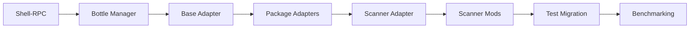

# Bottles Implementation - Team Coordination Plan

**Status**: ACTIVE  
**Date**: 2025-08-19  
**Implementation Lead**: bottles-architect  
**Technical Lead**: solution-architect

## Executive Summary

This plan coordinates 5 primary agents and 2 support agents to implement the Bottles architecture over 6 weeks, focusing exclusively on Python package manager support. The implementation follows a three-phase approach with clear handoffs and validation checkpoints.

## Team Structure

### Leadership Hierarchy

```
solution-architect (Technical Oversight)
    └── bottles-architect (Implementation Lead)
        ├── system-developer (Core Systems)
        ├── scanner-engineer (Integration)
        ├── test-architect (Validation)
        └── performance-analyst (Optimization)
            
requirements-analyst (Documentation Support)
token-optimizer (Reserved for Phase 4 - Not Active)
```

### Agent Roles and Responsibilities

#### bottles-architect (Implementation Lead)
**Role**: Overall implementation coordination and bottle system architecture  
**Responsibilities**:
- Lead daily standups and phase reviews
- Own volume management and bottle lifecycle
- Coordinate cross-team dependencies
- Ensure architectural consistency
- Manage CI/CD integration

**Key Deliverables**:
- Bottle Manager (Phase 1)
- Volume Controller (Phase 1)
- Configuration System (Phase 2)
- CI/CD Integration (Phase 3)

#### system-developer (Core Systems Lead)
**Role**: Implement critical infrastructure and package manager adapters  
**Responsibilities**:
- Build Shell-RPC engine (critical path)
- Ensure cross-platform compatibility
- Implement pip and uv adapters
- Modify Python scanner for bottles

**Key Deliverables**:
- Shell-RPC Engine (Phase 1)
- Platform Compatibility Layer (Phase 1)
- Pip/UV Adapters (Phase 2)
- Scanner Modifications (Phase 3)

#### scanner-engineer (Integration Lead)
**Role**: Package scanner and bottle integration  
**Responsibilities**:
- Create package manager base adapter
- Implement poetry and pipenv support
- Build scanner-bottle adapter
- Ensure scanner compatibility

**Key Deliverables**:
- Base Adapter (Phase 2)
- Poetry/Pipenv Adapters (Phase 2)
- Scanner-Bottle Adapter (Phase 3)

#### test-architect (Validation Lead)
**Role**: Testing strategy and migration  
**Responsibilities**:
- Build validation framework
- Migrate tests from mocks to bottles
- Ensure zero regression
- Validate cross-platform support

**Key Deliverables**:
- Validation Framework (Phase 2)
- Test Migration (Phase 3)
- Integration Test Suite (Phase 3)

#### performance-analyst (Optimization Lead)
**Role**: Performance monitoring and optimization  
**Responsibilities**:
- Implement diagnostics and logging
- Benchmark all operations
- Identify bottlenecks
- Recommend optimizations

**Key Deliverables**:
- Diagnostics System (Phase 1)
- Performance Benchmarks (Phase 3)
- Optimization Report (Phase 3)

## Communication Protocols

### Daily Coordination

**09:00 UTC - Daily Standup** (15 min)
- Lead: bottles-architect
- Format: Status, blockers, needs
- Output: Daily task assignments

**14:00 UTC - Technical Sync** (30 min, as needed)
- Lead: Whoever has blockers
- Format: Problem solving session
- Output: Technical decisions

**17:00 UTC - Progress Check** (10 min)
- Lead: bottles-architect
- Format: EOD status update
- Output: Next day planning

### Phase Reviews

**Phase Boundary Reviews** (2 hours)
- Lead: solution-architect
- Participants: All active agents
- Agenda:
  1. Phase deliverables review
  2. Architecture validation
  3. Risk assessment
  4. Next phase planning
  5. Go/no-go decision

### Handoff Protocols

#### Code Handoff Checklist
```markdown
- [ ] Code complete and tested
- [ ] Unit tests passing (>80% coverage)
- [ ] API documented
- [ ] Integration example provided
- [ ] Known issues documented
- [ ] Handoff meeting scheduled
- [ ] Recipient acknowledged
```

#### Documentation Handoff
```markdown
- [ ] Technical documentation complete
- [ ] API references updated
- [ ] Usage examples provided
- [ ] Migration guide written
- [ ] Architecture diagrams current
- [ ] Review meeting held
```

## Dependency Management

### Critical Path Dependencies



### Cross-Team Dependencies

| From | To | Deliverable | Phase | Timeline |
|------|-------|------------|-------|----------|
| system-developer | bottles-architect | Shell-RPC | 1 | Day 5 |
| bottles-architect | scanner-engineer | Bottle Manager | 1 | Day 9 |
| scanner-engineer | system-developer | Base Adapter | 2 | Day 17 |
| system-developer | test-architect | Package Adapters | 2 | Day 23 |
| scanner-engineer | test-architect | Scanner Adapter | 3 | Day 32 |
| test-architect | performance-analyst | Migrated Tests | 3 | Day 38 |

## Quality Gates

### Phase 1 Gate (Week 2)
**Owner**: solution-architect  
**Criteria**:
- [ ] Shell-RPC operational on Windows/macOS/Linux
- [ ] Volume controller managing cache correctly
- [ ] Bottle manager creating/destroying environments
- [ ] Platform compatibility verified
- [ ] Core infrastructure tests passing

**Go/No-Go Decision**: Proceed to Phase 2 only if all criteria met

### Phase 2 Gate (Week 4)
**Owner**: solution-architect  
**Criteria**:
- [ ] All 4 package managers operational
- [ ] Configuration system parsing YAML correctly
- [ ] Validation framework detecting issues
- [ ] Package installation successful
- [ ] Adapter tests passing

**Go/No-Go Decision**: Proceed to Phase 3 only if pip + one other working

### Phase 3 Gate (Week 6)
**Owner**: solution-architect  
**Criteria**:
- [ ] Scanner integration functional
- [ ] Tests migrated without regression
- [ ] Performance targets met (<30s init)
- [ ] Documentation complete
- [ ] CI/CD integration working

**Go/No-Go Decision**: Release readiness assessment

## Risk Management

### Risk Register

| Risk | Probability | Impact | Owner | Mitigation |
|------|------------|--------|-------|------------|
| Shell-RPC platform issues | Medium | High | system-developer | Early Windows testing |
| Cache size explosion | Low | Medium | bottles-architect | Size limits, pruning |
| Test migration breaks | Medium | High | test-architect | Incremental migration |
| Performance regression | Medium | Medium | performance-analyst | Continuous benchmarking |
| Package manager changes | Low | High | scanner-engineer | Version pinning |

### Escalation Path

1. **Technical Blocker**: Agent → Implementation Lead (bottles-architect)
2. **Architecture Issue**: Implementation Lead → Technical Lead (solution-architect)
3. **Resource Conflict**: Implementation Lead → Technical Lead
4. **Scope Change**: Technical Lead → User Decision
5. **Critical Failure**: All Stop → Team Review → Recovery Plan

## Work Allocation Strategy

### Parallel Work Streams

**Week 1-2 (Phase 1)**:
- Stream 1: system-developer on Shell-RPC
- Stream 2: bottles-architect on Volume Controller
- Stream 3: performance-analyst on Diagnostics

**Week 3-4 (Phase 2)**:
- Stream 1: system-developer on pip/uv
- Stream 2: scanner-engineer on poetry/pipenv
- Stream 3: test-architect on Validation
- Stream 4: bottles-architect on Configuration

**Week 5-6 (Phase 3)**:
- Stream 1: scanner-engineer on Adapter
- Stream 2: test-architect on Migration
- Stream 3: performance-analyst on Benchmarks
- Stream 4: requirements-analyst on Documentation

### Load Balancing

**High Load Agents** (15 days):
- system-developer
- bottles-architect

**Medium Load Agents** (12-14 days):
- scanner-engineer
- test-architect

**Support Load Agents** (3-8 days):
- performance-analyst
- requirements-analyst

**Mitigation**: If system-developer overloaded, scanner-engineer can assist with package adapters

## Success Metrics

### Team Performance Metrics

| Metric | Target | Measurement |
|--------|--------|-------------|
| Task Completion Rate | >90% | Tasks completed/planned |
| On-Time Delivery | >85% | Deliveries on schedule |
| Quality Gate Pass Rate | 100% | Gates passed first try |
| Test Coverage | >80% | Code coverage percentage |
| Defect Escape Rate | <5% | Bugs found post-phase |

### Technical Success Metrics

| Metric | Target | Current | Goal |
|--------|--------|---------|------|
| Python Packages Tested | 4 (mock) | 4 | 100+ (real) |
| Bottle Init Time | N/A | N/A | <30 seconds |
| Cache Hit Rate | N/A | N/A | >80% |
| Cross-Platform Success | Limited | 50% | >95% |
| Test Reliability | Mock only | 100% | >99% |

## Meeting Templates

### Daily Standup Template
```markdown
**Date**: [DATE]
**Lead**: bottles-architect
**Duration**: 15 minutes

**[Agent Name]**:
- Yesterday: [Completed tasks]
- Today: [Planned tasks]
- Blockers: [Any blockers]
- Needs: [Support needed]

**Action Items**:
- [ ] [Action item with owner]

**Key Decisions**:
- [Decision made]
```

### Phase Review Template
```markdown
**Phase**: [1/2/3]
**Date**: [DATE]
**Lead**: solution-architect

**Deliverables Review**:
- [ ] [Deliverable 1] - Status
- [ ] [Deliverable 2] - Status

**Quality Gate Assessment**:
- [ ] Criteria 1: [Pass/Fail]
- [ ] Criteria 2: [Pass/Fail]

**Risk Review**:
- New risks identified
- Mitigation effectiveness

**Next Phase Planning**:
- Priority adjustments
- Resource reallocation

**Go/No-Go Decision**: [Proceed/Hold/Adjust]
```

## Continuous Improvement

### Weekly Retrospectives

**Format**: Start/Stop/Continue
- What should we start doing?
- What should we stop doing?
- What should we continue doing?

### Process Improvements

Week 2: Review Shell-RPC approach
Week 4: Assess package manager complexity
Week 6: Full implementation retrospective

### Knowledge Sharing

- Daily code reviews between handoffs
- Weekly tech talks on complex components
- Documentation of lessons learned
- Shared troubleshooting guide

## Implementation Timeline

```
Week 1: Foundation
  Mon-Wed: Shell-RPC development
  Thu-Fri: Volume controller

Week 2: Infrastructure Complete
  Mon-Tue: Bottle manager
  Wed-Thu: Platform testing
  Fri: Phase 1 review

Week 3: Package Managers
  Mon-Tue: Base adapter
  Wed-Fri: pip and uv adapters

Week 4: Package Managers Complete
  Mon-Wed: Poetry and pipenv
  Thu: Configuration system
  Fri: Phase 2 review

Week 5: Integration
  Mon-Tue: Scanner adapter
  Wed-Thu: Scanner modifications
  Fri: Test migration start

Week 6: Finalization
  Mon-Tue: Complete test migration
  Wed-Thu: Performance benchmarks
  Fri: Phase 3 review and release
```

## Contingency Plans

### If Behind Schedule
1. Reduce scope to pip + uv only
2. Defer pipenv support
3. Simplify configuration system
4. Use mock/bottle hybrid

### If Quality Issues
1. Extend phase by 3 days
2. Add dedicated debugging time
3. Increase test coverage requirements
4. Add code review checkpoints

### If Resource Unavailable
1. Redistribute tasks to available agents
2. Extend timeline proportionally
3. Escalate to solution-architect
4. Consider external assistance

## Final Deliverables Checklist

### Code Deliverables
- [ ] Shell-RPC implementation
- [ ] Volume controller
- [ ] Bottle manager
- [ ] Package manager adapters (4)
- [ ] Scanner integration
- [ ] Test suite migration

### Documentation Deliverables
- [ ] Architecture documentation
- [ ] API reference
- [ ] Usage guide
- [ ] Migration guide
- [ ] Troubleshooting guide
- [ ] Performance report

### Quality Deliverables
- [ ] 80%+ test coverage
- [ ] All tests passing
- [ ] Cross-platform verified
- [ ] Performance benchmarks met
- [ ] CI/CD integrated
- [ ] Zero regressions